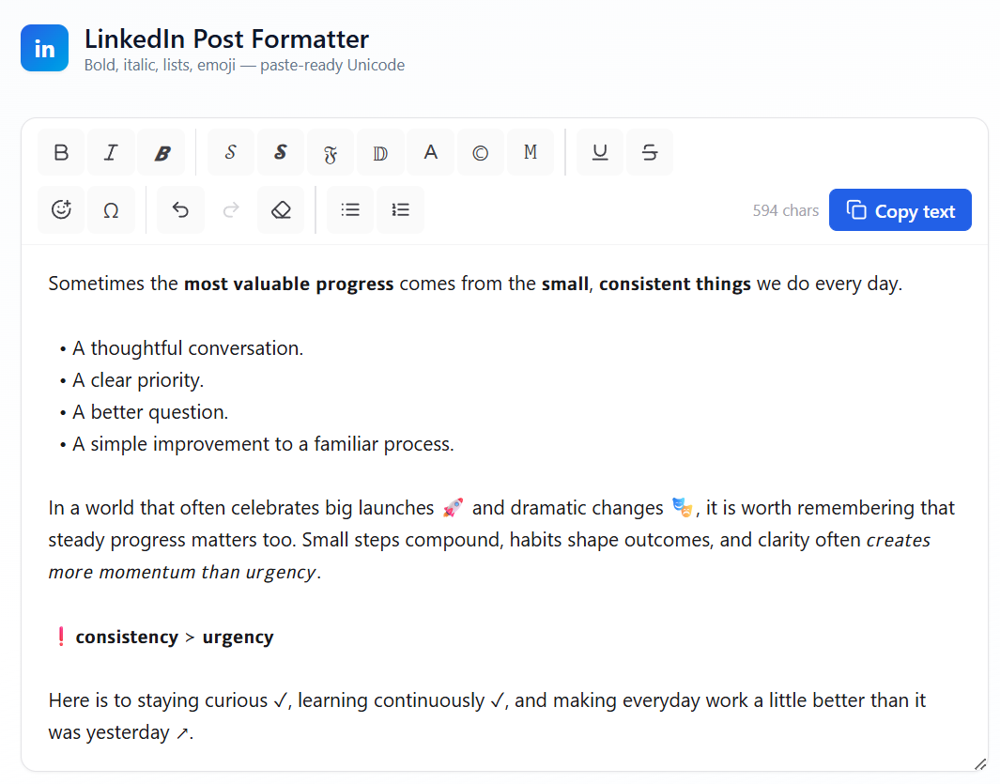

# LinkedIn Post Formatter

A small static web tool that formats text using Unicode characters so the styling survives a copy-paste into platforms that strip HTML — LinkedIn, X/Twitter, Slack, plain-text editors, etc. The page is two files. No build step. No backend.

**Try it: [robustagile.com/linkedin-formatter](https://robustagile.com/linkedin-formatter/)**



## Features

- **Type styles** — Bold (𝗕), Italic (𝘐), Bold Italic (𝘽); Script (𝒮) and Bold Script (𝓢); Fraktur (𝔉), Double-struck (𝔻), Fullwidth (Ａ), Circled (Ⓒ), Monospace (𝙼). Mutually exclusive — picking a different style replaces the current one; clicking the active style clears it.
- **Underline / Strikethrough** — combining diacritics that stack with any type style. Mutually exclusive with each other.
- **Bullet** and **Numbered** lists — operate on whole lines that intersect the selection; toggling the same list type strips it.
- **Emoji picker** — full emoji-mart picker (~1,800 emojis with search and categories).
- **Symbol picker** — Unicode block browser with tabs for **Icons** (Dingbats), **Arrows**, **Shapes**, **Currency**, **Misc Tech**, **Math**, **Math+** (supplemental), and **Misc Math** — about 1,400 characters total, click to insert. Hover any glyph to see its codepoint.
- **Undo / Redo** — Ctrl+Z, Ctrl+Shift+Z, or the toolbar buttons. Keyboard shortcuts for B / I / U also bound.
- **Erase formatting** — strips Unicode styling from the selection.
- **Copy text** — copies the textarea contents to the clipboard.
- **Mobile responsive** — below 768px the toolbar moves to a sticky bottom bar (single horizontal scroll, Copy pinned right); the emoji and symbol pickers slide up as full-width bottom sheets. Touch targets bump to 44×44.

The toolbar operates on the textarea selection. With no selection, formatting is applied to the entire text. List buttons always expand to whole-line boundaries.

## How it works

Letters and digits are mapped to a handful of Unicode blocks: the Mathematical Alphanumeric blocks (U+1D400…U+1D7FF) for sans/script/fraktur/double-struck/monospace, the Letterlike Symbols block (U+2100s) to fill in the canonical glyphs that the math blocks reserve (ℬ ℋ ℙ ℂ ℕ ℛ etc.), Halfwidth and Fullwidth Forms (U+FF00s) for fullwidth, and Enclosed Alphanumerics (U+2460s, U+24B6s) for circled. Underline and strikethrough are applied as combining diacritics (U+0332 and U+0336) appended after each character.

When underline or strikethrough is used without a type style, the text is first converted to the Monospace block, and regular spaces are swapped to EN QUAD (U+2000) so the line continues across word breaks.

## Deploying

Copy both files (`index.html` + `app.js`) into a directory on any static web server. They reference each other relatively, so the directory can sit at any subpath.

```
your-server/
└── any/path/you/like/
    ├── index.html
    └── app.js
```

That is the entire deployment.

### Requirements

- **Modern browser** — Chrome, Edge, Firefox, or Safari from the last ~3 years. The page uses `fetch`, ES2018, and custom elements (for the emoji picker).
- **Outbound internet on first load** — Tailwind, React 18, htm, and emoji-mart load from public CDNs (cdn.tailwindcss.com, unpkg, jsDelivr). The browser caches them after.
- **HTTPS recommended** — the Copy button uses the modern Clipboard API, which most browsers gate to HTTPS or `http://localhost`. Over plain HTTP it falls back to `document.execCommand("copy")` which still works in most browsers.

### Content Security Policy

If your server sends a `Content-Security-Policy` header, the browser will block the CDN scripts unless those hosts are allowed. Symptom: the console reports *"Loading the script ... violates the following Content Security Policy directive"* followed by `Uncaught ReferenceError: React is not defined`.

Add these to your CSP:

```
script-src  'self' 'unsafe-inline'
            https://cdn.tailwindcss.com
            https://unpkg.com
            https://cdn.jsdelivr.net;
connect-src 'self' https://cdn.jsdelivr.net;
```

`'unsafe-inline'` is required by the Tailwind Play CDN, which generates a `<style>` element at runtime. `connect-src` includes jsDelivr because the emoji picker `fetch()`'s its dataset from there.

If your environment cannot allow public CDNs, the alternative is to self-host the four scripts (React, ReactDOM, htm, emoji-mart) plus the emoji dataset and a precompiled Tailwind stylesheet, and rewrite the `<script>` / `<link>` tags in `index.html` to point at same-origin paths.

### Tailwind CDN warning (optional fix)

The Tailwind Play CDN prints a *"should not be used in production"* notice in DevTools. It's purely advisory and the page works fine. To silence it, precompile a Tailwind stylesheet and replace the `<script src="https://cdn.tailwindcss.com">` line with a `<link rel="stylesheet">`.

## Browser support notes

- The Unicode math characters render via the OS font stack. Most modern systems render them fine; very old systems may show fallback boxes for some glyphs.
- Emojis are native characters — they render with the OS emoji font, no images downloaded.
